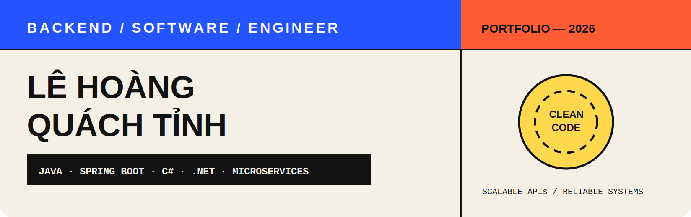
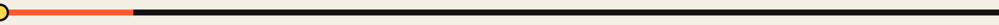
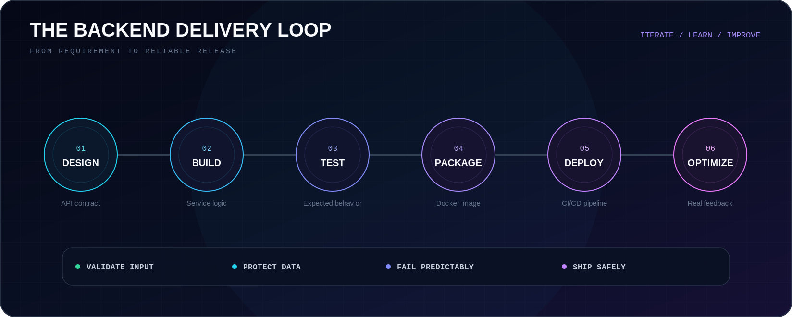

<div align="center">


<br/>

<a href="https://portfolio-seven-bice-65.vercel.app/"></a>
<a href="https://www.linkedin.com/in/l%C3%AA-ho%C3%A0ng-qu%C3%A1ch-t%E1%BB%89nh-56a0a0376"></a>
<a href="mailto:lhqtinh2005@gmail.com"></a>
<a href="https://zalo.me/0366900821"></a>

</div>

<br/>






## About Me

I build scalable backend systems with clean code, reliable APIs, and maintainable architecture. I enjoy solving complex problems through thoughtful database design, secure services, and practical engineering.

```java
var developer = Map.of(
    "name", "Lê Hoàng Quách Tỉnh",
    "role", "Backend Software Engineer",
    "focus", List.of("Scalable Web APIs", "Microservices", "Database Optimization"),
    "motto", "Clean Code is Happy Code ✨"
);
```

- 💻 Building production-ready REST APIs with Spring Boot and .NET
- 🧩 Designing microservices and optimizing database performance
- 🚀 Exploring cloud platforms and contributing to open source


## The Backend Stack Map

A connected view of the technologies I use to design APIs, build services, manage data, and ship reliable software.



<div align="center">

### Core Toolkit


<br/>


</div>


## What I Build

- 🔌 **Scalable Web APIs** — Clean, versioned, and maintainable REST services.
- 🧩 **Microservices** — Focused services with clear boundaries and reliable communication.
- 🗄️ **Data-Driven Systems** — Practical schemas, efficient queries, and database optimization.
- 🛡️ **Reliable Delivery** — Validation, testing, Docker, Git, and CI/CD.

`Spring Boot` · `.NET` · `REST APIs` · `Microservices` · `Database Optimization`


## The Backend Delivery Loop

Understand the problem, design the API, build the service, test its behavior, ship it safely, and optimize from real feedback.




## Current Focus

- Mastering Spring Boot and microservices
- Contributing to open-source projects
- Learning Azure and AWS
- Building production-ready REST APIs

📚 **Reading:** *Designing Data-Intensive Applications*<br/>
☕ **Fuel:** Coffee + Clean Code


## GitHub Activity

<div align="center">


</div>


<br/>

---

<div align="center">

### Clean Code is Happy Code ✨

<a href="https://portfolio-seven-bice-65.vercel.app/"></a>
<a href="mailto:lhqtinh2005@gmail.com"></a>

<br/><br/>

<sub>Designed and built by Lê Hoàng Quách Tỉnh.</sub>

</div>
